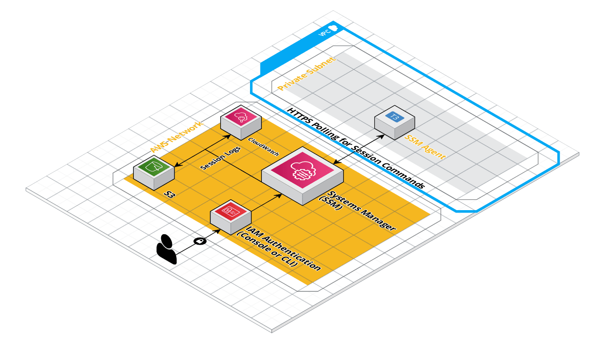
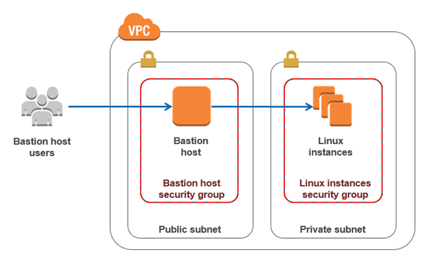
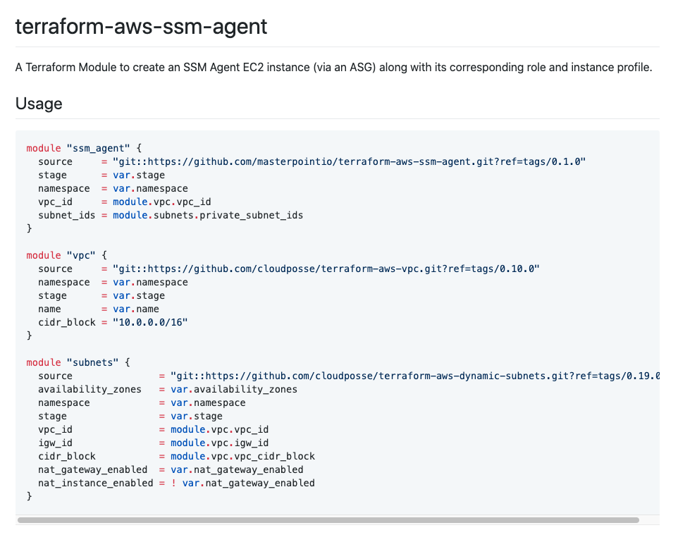

# AWS SSM Agent Session Manager > Bastion Hosts

## tl;dr

Bastion hosts are a pain; Using AWS SSM Agents combined with Session Manager is superior for getting a shell into your cloud environment. I've open sourced [a Terraform module for spinning up a small, autoscaled SSM Agent instance here](https://github.com/masterpointio/terraform-aws-ssm-agent), so use that and prosper.

## Background

Most application and DevOps engineers are used to using a [Bastion host](https://en.wikipedia.org/wiki/Bastion_host) (also called a jump box) as their way to run ad-hoc commands against their cloud environment. Administering the database, opening a `rails console` or `manage.py shell`, or even checking the logs of that backwater service that isn't yet wired up to your log aggregator of choice: We try to avoid these one-off tasks as much as possible, but the truth is they're part of the application lifecycle and they're not going anywhere because it's not cost effective to automate every single task.

I say that's fine. I accept that we need to do these ad-hoc tasks, but I want to do them in a secure, auditable, and reliable way. Bastion hosts have been the tool I have used to accomplish that since the start of my career. Spin up a small bastion server in a public subnet, add your public key to `~/.ssh/authorized_keys`, `ssh` in, and you've now got shell access inside your cloud provider.

Except this isn't as great as it sounds...

1. Your bastion server is likely open on port 22 to the wider internet (unless you've got a company VPN). This leaves it open to malicious actors trying to gain access to your private resources.
1. Got a team of people who need access to Bastion? Unfortunately, you're now in the business of managing their SSH Keys. :(
1. Want to the ability to audit `ssh` sessions on your bastion box? [That's doable, but not without more work...](https://aws.amazon.com/blogs/security/how-to-record-ssh-sessions-established-through-a-bastion-host/)
1. Want to add Multi-Factor Auth to further secure access to your Bastion host? [Again, that's doable](https://aws.amazon.com/blogs/startups/securing-ssh-to-amazon-ec2-linux-hosts/), but add more work to the pile of your already packed week.

IMO those problems and the work they require to solve are a thing of the past -- We have Cloud provider solutions that handle these problems natively and pain free. In this article I'll make the case for doing away with the standard Bastion host and using AWS SSM Session Manager to securely administer your Cloud environment.

## SSM Agent and Session Manager

Amazon can describe an SSM Agent better than I can, so lets let their definition start us off:

> AWS Systems Manager Agent (SSM Agent) is Amazon software that can be installed and configured on an EC2 instance, an on-premises server, or a virtual machine (VM). SSM Agent makes it possible for Systems Manager to update, manage, and configure these resources.

In other words, an SSM Agent is an EC2 instance that is running the AWS agent software so that the instance can effectively communicate with the AWS system. [This unlocks a bunch of cool functionality](https://docs.aws.amazon.com/systems-manager/latest/userguide/features.html) which I won't go into (but I encourage you to at least glance at), but the main feature that we care about for this article is [Session Manager](https://docs.aws.amazon.com/systems-manager/latest/userguide/session-manager.html).

Session Manager uses the SSM Agent as the conduit to directly connect you to the instance through the AWS Console or AWS CLI. You authenticate with AWS through your IAM user profile (either via the AWS Console or AWS CLI) and then AWS provides you a shell session on your specified SSM Agent instance. This a beautiful thing which has a long list of benefits:

1. Your SSM Agent can (and should) be in a private subnet, which means you no longer have any ports open to the internet. This removes a huge attack surface area that you previously needed to worry about.
1. No more SSH Key management. You and your team already have IAM user profiles, right? Great, add a `ssm:StartSession` permission policy to the groups/users you'd like to have access to administer your cloud environment and they'll be good to go.
1. Want the ability to audit sessions so you can see what Steve was up to at 1am on a Saturday? [Session Manager supports that via a couple clicks](https://docs.aws.amazon.com/systems-manager/latest/userguide/session-manager-logging-auditing.html#session-manager-logging-auditing-cloudwatch-logs).
1. Want to make sure folks are Multi-Factor Authenticated before starting a Session? [Add the `"aws:MultiFactorAuthPresent": "true"` condition to your StartSession IAM policy](https://docs.aws.amazon.com/IAM/latest/UserGuide/id_credentials_mfa_configure-api-require.html#MFAProtectedAPI-user-mfa).

Now all that sounds awesome, but how do you make it happen? It's simple:

1. Spin up a latest Amazon Linux 2 AMI EC2 instance in one of your private subnets.
1. Attach an IAM instance profile which has the AWS Managed `AmazonSSMManagedInstanceCore` policy to your new instance.
1. Make sure your user has the `ssm:StartSession` permission.
1. Then head over to [the SSM Session Manager Console](https://console.aws.amazon.com/systems-manager/session-manager/start-session), pick your instance, and click 'Start Session'.
1. You're in!

If my abridged instructions don't cut it for you (wouldn't blame you) then I suggest checking out these [AWS Docs here](https://docs.aws.amazon.com/systems-manager/latest/userguide/session-manager-getting-started.html).

Or if you're a Terraform person and you want a simpler, automated option then check out my [`terraform-aws-ssm-agent` Terraform module](https://github.com/masterpointio/terraform-aws-ssm-agent). This simple module handles creating the proper IAM instance profile, Security Group, Launch Template, and Autoscaling Group to add a small SSM Agent instance to your VPC.

## Conclusion

Bastion hosts require a non-trivial amount of work to secure, audit, and manage. They used to be a good tool, but we have a better option nowadays: AWS SSM Agent + Session Manager. By using SSM Agents and Session Manager you avoid the security and auditing pitfalls that Bastion hosts inherently have. Next time you get the chance, I suggest your ditch you less-secure, old-school bastion host and upgrade to the superior Session Manager.
